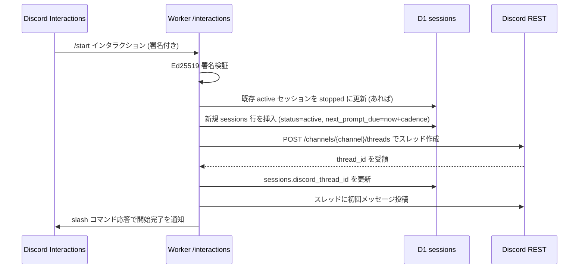
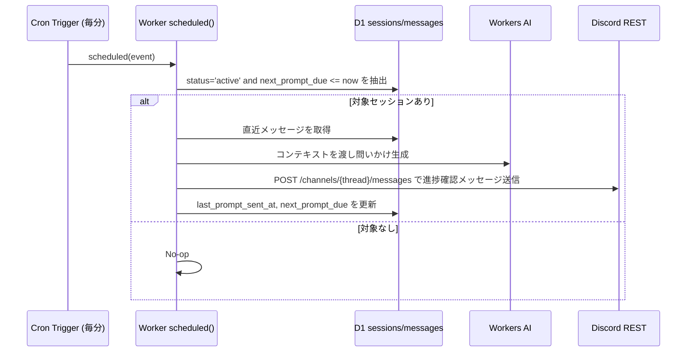
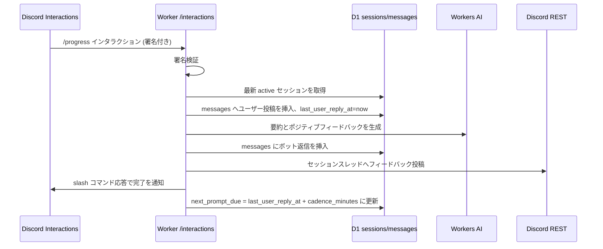

# プロセスフローとデータモデル

## 採用スタック概要

- **ランタイム:** Cloudflare Workers（モジュールワーカー）＋ Hono ベースの軽量ルーター。
- **永続化:** Cloudflare D1（会話・スケジューリングの正）、Workers KV（任意キャッシュ。現状は必須ではないが将来の高速化用に検討）。
- **AI:** Cloudflare Workers AI（進捗確認文生成に Llama 3.1 8B instruct、要約・フィードバックに bart-large-cnn を想定）。
- **トリガ:** Cloudflare Workers Cron Trigger を **毎分（`* * * * *`）** 起動し、送信期限が到来したセッションのみ処理。必要に応じて **Workers Queues** によるデカップリングへ拡張可能。
- **Slash コマンド:** `/start` で新規セッションと専用スレッドを作成、`/stop` でアクティブセッションを終了、進捗登録は `/progress` コマンドのみで受け付ける（メッセージコンポーネントによる入力は使用しない）。

## 高レベル処理フロー

1. **セッション開始 `/start`**

   - Discord からの署名付きリクエストを検証し、既存のアクティブセッションがあれば `status = 'stopped'` に更新。
   - 新しいセッション ID（ULID/UUID）を発行し、`sessions` に `status = 'active'` で挿入。`started_at = now`、`next_prompt_due = now + cadence_minutes`（既定 20 分）。
   - Discord REST API のスレッド作成エンドポイント（`POST /channels/{channel_id}/threads` など）を呼び出し、セッション専用のスレッドを生成。作成された `discord_thread_id` をセッションに保存。
   - スレッド内に初回メッセージ（セッション開始通知や `/progress` の使い方）を投稿し、slash コマンドへの同期応答では開始完了を返す。

2. **セッション終了 `/stop`**

   - 署名検証後、最新のアクティブセッションを取得して `status = 'stopped'`、`ended_at = now` に更新し、`next_prompt_due` を null にする。
   - 対象スレッドに終了メッセージを投稿（任意）。slash コマンドへの応答で完了を通知。

3. **進捗報告 `/progress`**

   - 進捗テキストは `/progress` コマンドのみで受け付ける。実行時にアクティブセッションを取得し、`messages` にユーザー投稿を保存。`last_user_reply_at = now` を更新。
   - Workers AI で短い要約とポジティブフィードバックを生成。生成結果を `messages` に保存し、フォローアップレスポンスとしてセッションスレッドへ返信。
   - 次回進捗確認時刻を `next_prompt_due = last_user_reply_at + cadence_minutes` に再設定。

4. **進捗確認の定期メッセージ**
   - Cron Trigger が毎分起動し、`status = 'active'` かつ `next_prompt_due <= now` のセッションを抽出。
   - 各セッションについて直近メッセージを D1 から取得し、Workers AI に前回進捗を踏まえた問いかけ文を生成させる。
   - 生成したメッセージを対象スレッド（`discord_thread_id`）に投稿し、`last_prompt_sent_at = now`、`next_prompt_due = now + cadence_minutes` を更新。
   - セッション数が増えた際は、Cron で検出したセッションを Workers Queues へ enqueue し、コンシューマーで AI 呼び出しと Discord 投稿を処理する構成へ拡張可能。

## D1 データモデル

`/start`〜`/stop` の各区間をセッションとして扱うため、以下のテーブルを採用する。

### `sessions`

| column                | type             | description                                                                    |
| --------------------- | ---------------- | ------------------------------------------------------------------------------ |
| `id`                  | TEXT PRIMARY KEY | ULID/UUID。`/start` ごとに新規発行。                                           |
| `discord_channel_id`  | TEXT             | セッション用スレッドを作成する元チャンネル（ラバーダック専用チャンネルなど）。 |
| `discord_thread_id`   | TEXT             | `/start` 時に作成したスレッドの ID。                                           |
| `status`              | TEXT             | `active` / `stopped` / `paused`。                                              |
| `started_at`          | INTEGER          | セッション開始時刻（Unix epoch ms）。                                          |
| `ended_at`            | INTEGER          | セッション終了時刻（終了時のみ）。                                             |
| `cadence_minutes`     | INTEGER          | 進捗確認間隔（既定 20）。                                                      |
| `next_prompt_due`     | INTEGER          | 次の進捗確認送信予定時刻。`stopped` 状態では null。                            |
| `last_prompt_sent_at` | INTEGER          | 直近の進捗確認送信時刻。                                                       |
| `last_user_reply_at`  | INTEGER          | 直近のユーザー進捗報告時刻。                                                   |

> 単一ユーザー想定のため `user_id` 列は省略。将来複数ユーザー化する際は追加で拡張可能。

### `messages`

| column               | type             | description                                  |
| -------------------- | ---------------- | -------------------------------------------- |
| `id`                 | TEXT PRIMARY KEY | ULID/UUID。                                  |
| `session_id`         | TEXT             | `sessions.id` を参照。                       |
| `author`             | TEXT             | `user` / `bot` / `system`。                  |
| `discord_message_id` | TEXT             | スレッド内に投稿した Discord メッセージ ID。 |
| `content`            | TEXT             | 進捗テキストまたはボットの返信。             |
| `created_at`         | INTEGER          | 生成時刻（Unix epoch ms）。                  |

### `ai_requests`（任意）

| column          | type             | description                                   |
| --------------- | ---------------- | --------------------------------------------- |
| `id`            | TEXT PRIMARY KEY | ULID/UUID。                                   |
| `session_id`    | TEXT             | `sessions.id` を参照。                        |
| `kind`          | TEXT             | `prompt_generation` / `summary_feedback` 等。 |
| `model`         | TEXT             | 使用モデル ID。                               |
| `input_tokens`  | INTEGER          | 入力トークン数。                              |
| `output_tokens` | INTEGER          | 出力トークン数。                              |
| `created_at`    | INTEGER          | 呼び出し時刻。                                |

## シーケンス図

### `/start` による新規セッションとスレッド作成

### 毎分 Cron による進捗確認メッセージ送信

### `/progress` による進捗登録

## 実装メモ

- `/start` でスレッドを作成するために、ボットには対象チャンネルでの `MANAGE_THREADS` 権限が必要。公開スレッド／プライベートスレッドの使い分けは運用ポリシーに応じて選択する。
- D1 Sessions API を活用し、セッション行の更新とメッセージ挿入をトランザクション化すると read-after-write が保証される。
- スレッド ID を保持しておくことで、Cron や `/progress` から常に正しいスレッドへ投稿できる。スレッド削除などの例外時は `discord_thread_id` を null に戻し、再作成する処理を用意すると堅牢。
- Cron は毎分起動する前提なので、`SELECT id, discord_thread_id, cadence_minutes FROM sessions WHERE status='active' AND next_prompt_due <= ?` のように対象を限定し、なければ即終了する。
- Workers Queues へ拡張する場合は、Cron で検出したセッション ID を enqueue → コンシューマーが AI 呼び出しと Discord 投稿、`sessions` 更新を行う構成を採用する。
- `/stop` 実行後は `next_prompt_due` を null にするか、条件句で `status='active'` のみ抽出することで Cron の誤送信を防ぐ。
- `/progress` は唯一の進捗入力手段とし、メッセージコンポーネントにテキスト入力を設けない運用で UI をシンプルに保つ。
