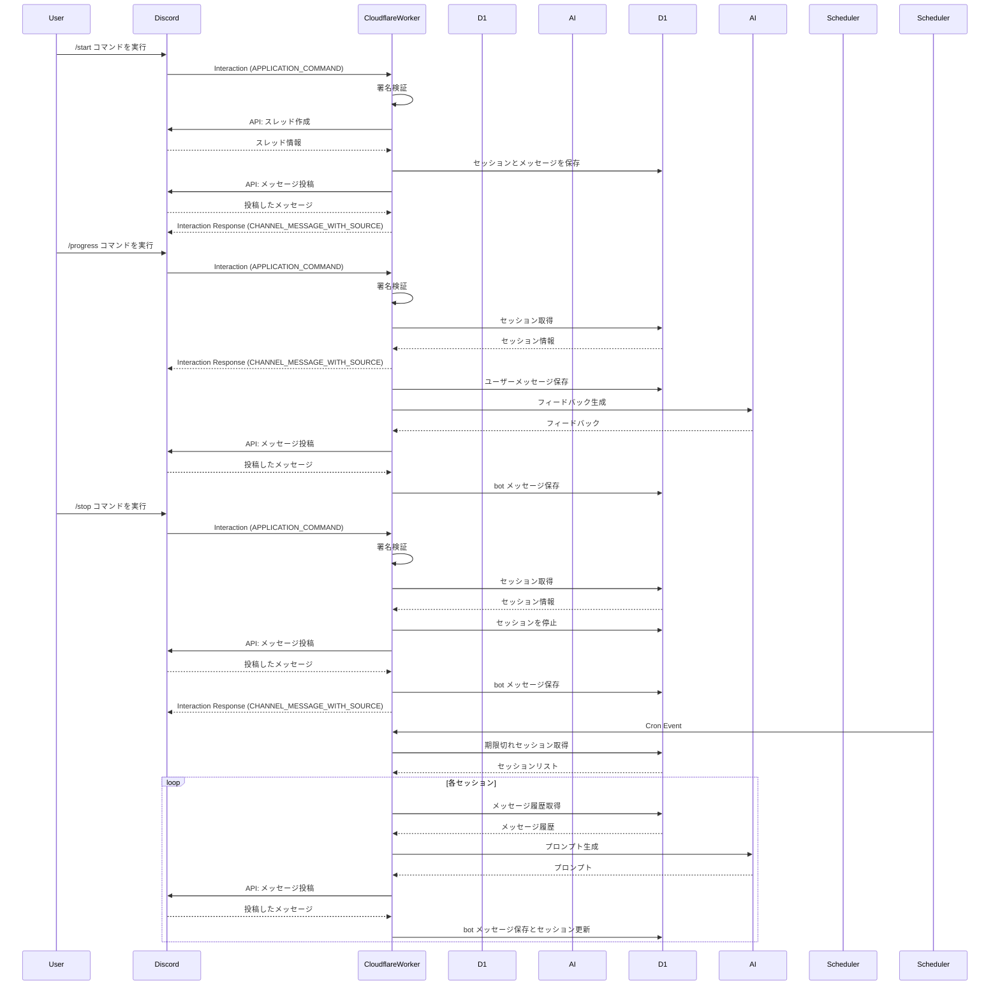

# シーケンス図

## Discord bot の処理の流れ

```mermaid
sequenceDiagram
  participant User
  participant Discord
  participant CloudflareWorker
  participant CloudflareD1 as D1
  participant CloudflareAI as AI

  User->>Discord: /start コマンドを実行
  Discord->>CloudflareWorker: Interaction (APPLICATION_COMMAND)
  CloudflareWorker->>CloudflareWorker: 署名検証
  CloudflareWorker->>Discord: API: スレッド作成
  Discord-->>CloudflareWorker: スレッド情報
  CloudflareWorker->>D1: セッションとメッセージを保存
  CloudflareWorker->>Discord: API: メッセージ投稿
  Discord-->>CloudflareWorker: 投稿したメッセージ
  CloudflareWorker-->>Discord: Interaction Response (CHANNEL_MESSAGE_WITH_SOURCE)

  User->>Discord: /progress コマンドを実行
  Discord->>CloudflareWorker: Interaction (APPLICATION_COMMAND)
  CloudflareWorker->>CloudflareWorker: 署名検証
  CloudflareWorker->>D1: セッション取得
  D1-->>CloudflareWorker: セッション情報
  CloudflareWorker-->>Discord: Interaction Response (CHANNEL_MESSAGE_WITH_SOURCE)
  CloudflareWorker->>D1: ユーザーメッセージ保存
  CloudflareWorker->>AI: フィードバック生成
  AI-->>CloudflareWorker: フィードバック
  CloudflareWorker->>Discord: API: メッセージ投稿
  Discord-->>CloudflareWorker: 投稿したメッセージ
  CloudflareWorker->>D1: bot メッセージ保存

  User->>Discord: /stop コマンドを実行
  Discord->>CloudflareWorker: Interaction (APPLICATION_COMMAND)
  CloudflareWorker->>CloudflareWorker: 署名検証
  CloudflareWorker->>D1: セッション取得
  D1-->>CloudflareWorker: セッション情報
  CloudflareWorker->>D1: セッションを停止
  CloudflareWorker->>Discord: API: メッセージ投稿
  Discord-->>CloudflareWorker: 投稿したメッセージ
  CloudflareWorker->>D1: bot メッセージ保存
  CloudflareWorker-->>Discord: Interaction Response (CHANNEL_MESSAGE_WITH_SOURCE)

  participant CloudflareScheduler as Scheduler
  Scheduler->>CloudflareWorker: Cron Event
  CloudflareWorker->>D1: 期限切れセッション取得
  D1-->>CloudflareWorker: セッションリスト
  loop 各セッション
    CloudflareWorker->>D1: メッセージ履歴取得
    D1-->>CloudflareWorker: メッセージ履歴
    CloudflareWorker->>AI: プロンプト生成
    AI-->>CloudflareWorker: プロンプト
    CloudflareWorker->>Discord: API: メッセージ投稿
    Discord-->>CloudflareWorker: 投稿したメッセージ
    CloudflareWorker->>D1: bot メッセージ保存とセッション更新
  end
```
